# Screen Implementation Guide

This guide provides technical and visual details for every screen in the NARI application.

## 🔐 Auth & Onboarding

### Language Selection
- **Purpose**: Initial language setup (English/Kannada).
- **Mockup**: 

### Sign Up
- **Purpose**: Phone number registration.
- **Mockup**: 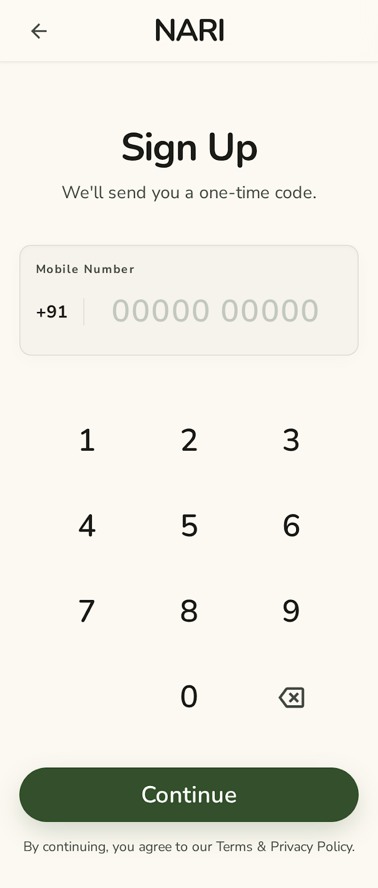

### OTP Verification
- **Purpose**: 6-digit verification code entry.
- **Mockup**: 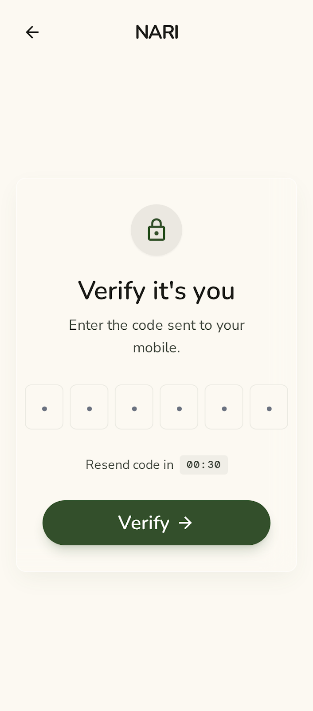

### Add Emergency Contacts
- **Purpose**: Selecting and prioritizing contacts.
- **Mockup**: 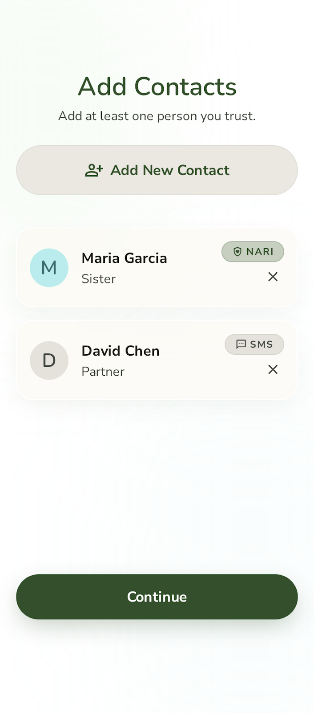

### Permissions
- **Purpose**: Requesting Location, Notifications, etc.
- **Mockup**: 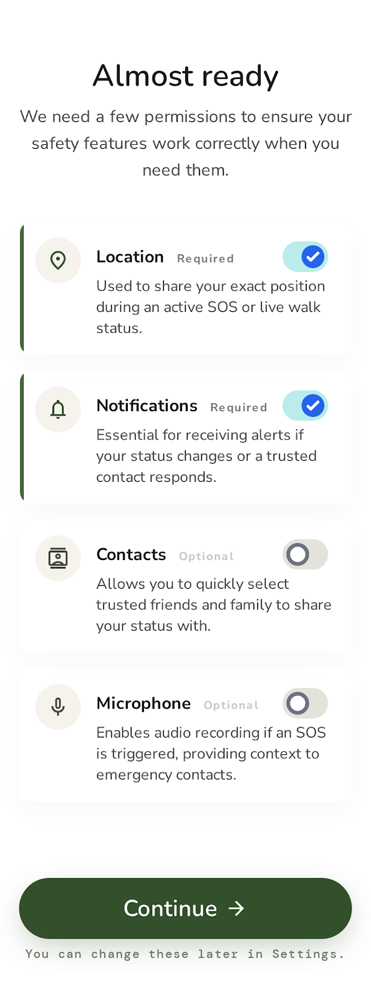

---

## 🏠 Dashboard (Home)

### Home — Safe State
- **Purpose**: Primary status display and navigation.
- **Mockup**: 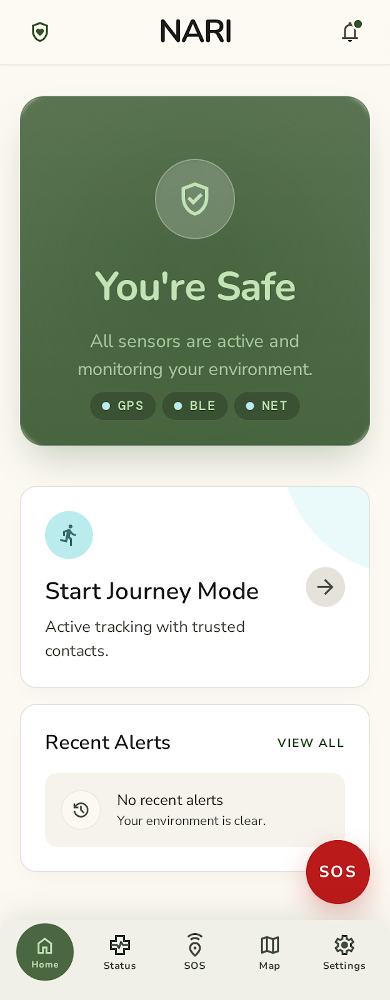

### Status Monitoring
- **Purpose**: Real-time signal tracking (Status Tab).
- **Mockup**: 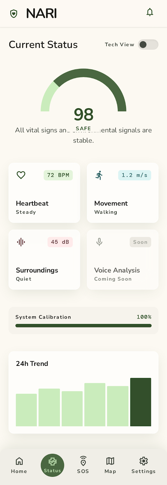

---

## 🚨 SOS & Emergency

### SOS Countdown
- **Purpose**: 10-second grace period before alert dispatch.
- **Mockup**: 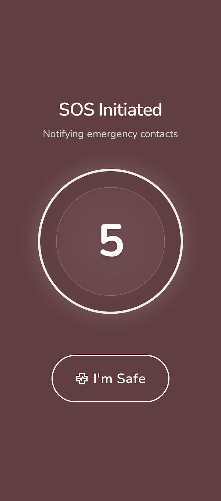

### SOS Active
- **Purpose**: Emergency tracking and 112 quick-call.
- **Mockup**: 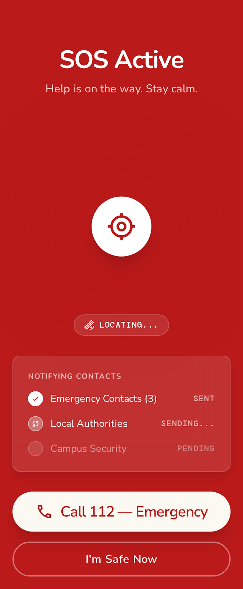

---

## 🗺️ Maps & Safety

### Safety Map
- **Purpose**: Heatmap of local incidents.
- **Mockup**: 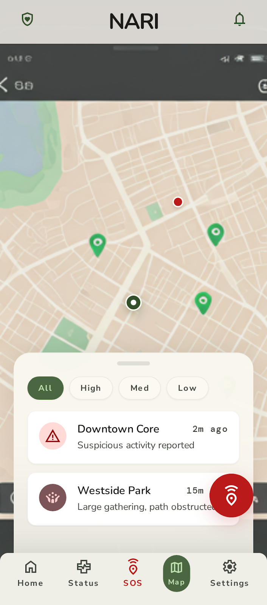

### Incident Detail
- **Purpose**: Details of a specific reported incident.
- **Mockup**: 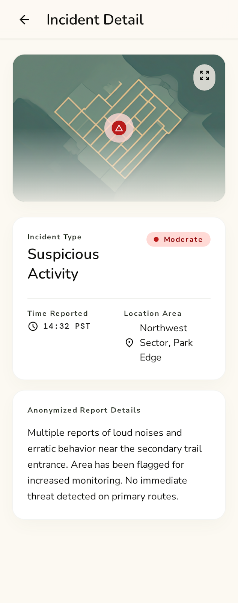

---

## 📍 Journey Mode

### Journey Mode Active
- **Purpose**: Live location sharing during solo travel.
- **Mockup**: 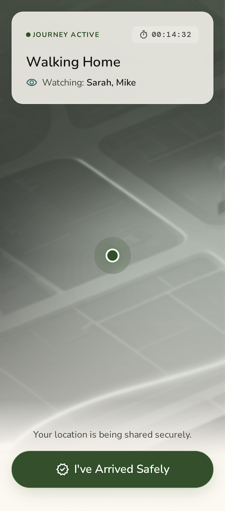

---

## 🔔 Receiving Alerts

### Alert Received
- **Purpose**: Displayed on a contact's phone when they receive an SOS.
- **Mockup**: 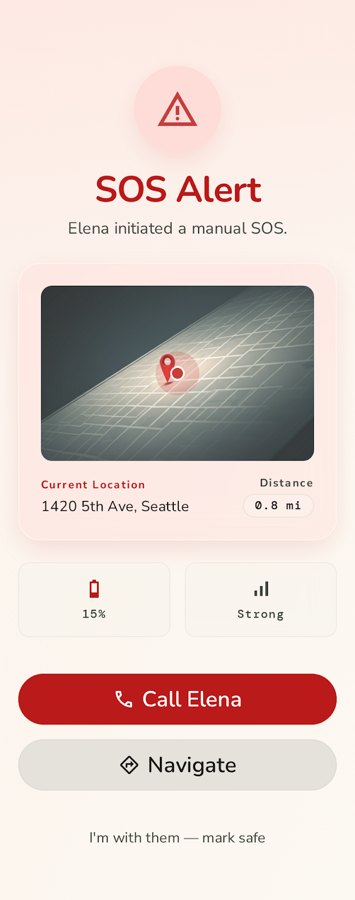

---

## ⚙️ Settings & History

### Settings Root
- **Purpose**: App configuration and device management.
- **Mockup**: 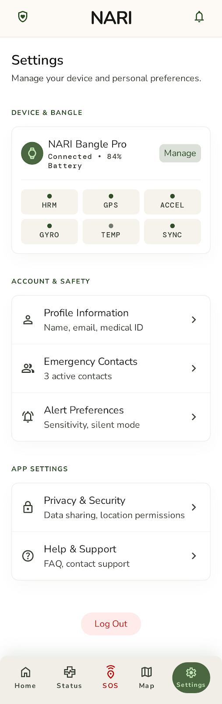

### Alert History
- **Purpose**: Past emergency events.
- **Mockup**: 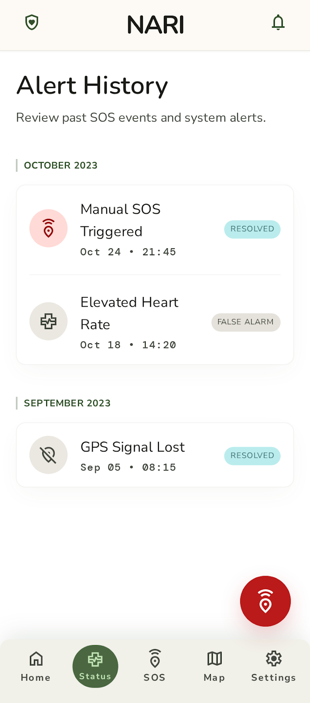

### Alert Details
- **Purpose**: Technical post-mortem of an alert.
- **Mockup**: 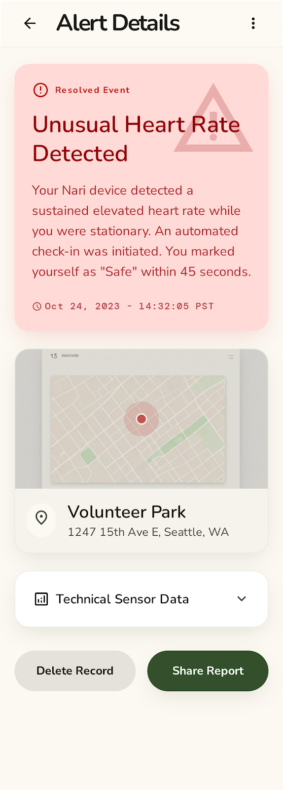
